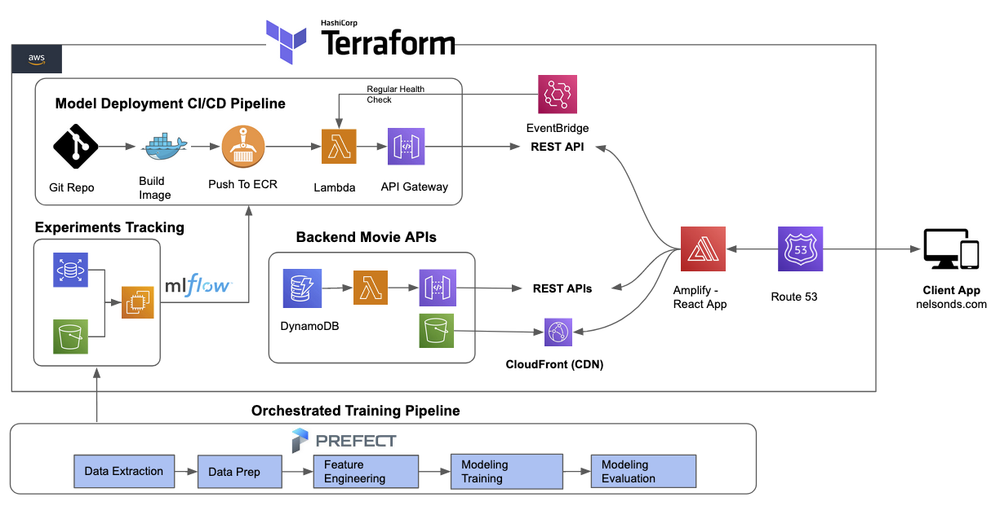

# React Interactive Movie Recommendation System Based on Behavior Sequence Transformer Model

## Brief Introduction
The Interactive Movie Recommendation System is a react application built with Javascript. It utilizes machine learning techniques to recommend movies to users based on their demographic information and movie viewing history. The system is designed to provide an interactive and personalized movie recommendation experience.


## React Frontend Preview: 


## Run the React Application At Local

```sh
npm install
npm run dev
```

## Full Stack Machine Learning Serverless Architecture

The Interactive Movie Recommendation System follows a full stack machine learning serverless and microservices architecture. The architecture consists of several major components that work together to provide a seamless movie recommendation experience.

 </img>


 React + Typescript Movie Recommendation Application 

**Tech Stack**: React, Typescript, Vite, Chakra UI, AWS Amplify, Route 53

The front end of the Interactive Movie Recommendation System is built using React and Typescript. The application integrates with the deployed recommendation API and the backend Movies API to provide a seamless user experience. The UI is designed using Chakra UI, which provides a set of accessible and customizable UI components. Vite is used as the build tool for fast development and HMR (Hot Module Replacement). The application is deployed using AWS Amplify, which simplifies the deployment process. Route 53 is used for DNS management and routing the application traffic pointing to the domain  [ArjunDev.com](https://ArjunDev.com).


